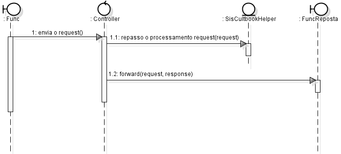
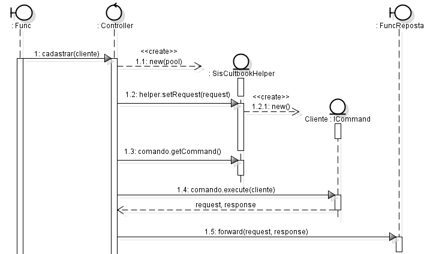
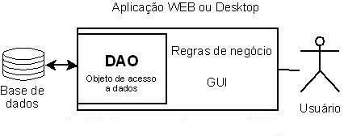
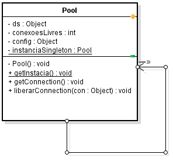

# Projeto Final Faculdade Estácio Sá - Ano 2011

Aplicação de venda de livros online.

Esta ferramenta possui flexibilidade de pesquisas de obras por título, autor, e editoras, um espaço para o cliente se cadastrar e um carrinho de compras para armazenar sua lista de desejos e possui ainda toda uma estrutura para que o cliente faça sua compra segura pelo sistema.


## Padrões Utilizados no Projeto

### Model-View-Control (MVC)

O padrão **model-view-controller (MVC)** permite que você separe o código em diferentes objetos lógicos que servem para tarefas bastante específicas.
* **Models (Modelos)** - Servem como uma camada de acesso aos dados onde esses dados são requisitados e retornados em formatos nos quais possam ser usados no decorrer de sua aplicação.
* **Controllers (Controladores)** - Tratam as requisições, processam os dados retornados dos Models e carregam as views (Visões) para enviar a resposta.
* **Views (Visões)** - São templates de saída (marcação, xml, tpl, html, etc) que são enviadas como resposta ao navegador.

* Padrão “Front Controller”.

O **Controlador** é um ponto de acesso para processamento de requisições: chama serviços de segurança (autenticação e autorização), delega processamento à camadas de negócio, define uma visão apropriada, realiza tratamento de erros, define estratégias de geração de conteúdo.
O sistema foi desenvolvido, com o proposito de gerenciar um ponto de acesso centralizado para processamento de todas as requisições recebidas pela camada de apresentação, controlar a navegação entre os objetos da visão, remover duplicação de código, estabelecer responsabilidades mais definidas para cada objeto facilitando a manutenção e extensão.

Na figura abaixo o Front Controller delega processamento a um objeto de apoio (Helper), onde é utilizado o padrão de projeto “Command”, com a competência para realizar a operação decidir qual serviço utilizar.



* Padrão **Command**.

O padrão **Command** separa o mecanismo que trata a solicitação (request) do serviço que realiza atarefa a ser executada.
Command (no contexto de aplicações web) é uma adaptação do padrão de Gamma et al. (1995) como estratégia de implementação do **Front Controller**. É um padrão que pode ser implementado em aplicações web na forma mais simples, até à mais elaborada.
Para aplicações que adotam Servlets, por exemplo, uma solução simples é tratar o comando que vem na solicitação, enviado com parâmetro na solicitação, normalmente chamado de action ou comando. Esse parâmetro que informa a ação do comando contém um de vários valores das tarefas a serem executados na aplicação. O servlet de controle recupera o valor da ação como parâmetro da solicitação, e determina qual a lógica de negócio deve ser executado pelo objeto Command.
 A definição desse padrão no catálogo JEE de padrões é realizada pelo padrão "Service to Worker". A Figura abaixo mostra um exemplo simplificado de Command para um cadastro de cliente no sistema cultbook.



* Padrão **DAO** – Data Access Object.

Este padrão permite criar as classes de dados independentemente da fonte de dados ser um BD relacional, um arquivo texto, um arquivo XML, etc. Para isso, ele encapsula os mecanismos de acesso a dados e cria uma interface de cliente genérica para fazer o acesso aos dados permitindo que os mecanismos de acesso a dados sejam alterados independentemente do código que utiliza os dados. Algumas características desejáveis em uma implementação do padrão DAO:

-	Todo o acesso aos dados deve ser feita através das classes DAO de forma a se ter o encapsulamento;
- Cada instância da DAO é responsável por um objeto de domínio;
- O DAO deve ser responsável pelas operações CRUD no domínio;
- O DAO não deve ser responsável por transações, sessões ou conexões que devem ser tratados fora do DAO;



* Padrão **Singleton**.

Este padrão permite centralizar a responsabilidade em uma única instância de classe, provendo um ponto de acesso global a ela.
A instância do objeto pode ser feito quando a classe for carregada ou quando o método de criação for chamado pela primeira vez.
No sistema foi desenvolvida uma classe que faz a conexão com o banco de dados implementando somente uma instância da classe usando este padrão de projeto.



## Tecnologias Utilizadas

* **JAVA** - Java é uma linguagem de programação interpretada orientada a objetos desenvolvida na década de 90 por uma equipe de programadores chefiada por James Gosling, na empresa Sun Microsystems. Diferente das linguagens de programação convencionais, que são compiladas para código nativo, a linguagem Java é compilada para um bytecode que é interpretado por uma máquina virtual (Java Virtual Machine, mais conhecida pela sua abreviação JVM). A linguagem de programação Java é a linguagem convencional da Plataforma Java, mas não é a sua única linguagem.

* **jQuery** - O [jQuery](http://jquery.com/) é uma biblioteca de Javascript super leve, muito fácil de usar e com uma curva de aprendizagem relativamente curta. Substitui as maiores e maiores complicadas tarefas do Javascript por funções mais directas, rápidas e compatíveis com a generalidade dos browsers. O objectivo do jQuery é tornar o Javascript muito mais fácil de utilizar nos projetos e websites. Esta biblioteca facilita as tarefas mais comuns que necessitam de muitas linhas de código Javascript e empacota-as em métodos que produzem o mesmo resultado, com muito menos código. Às vezes numa única e simples linha de código. O jQuery simplifica também o que é mais complicado no Javascript como o AJAX e a manipulação do DOM.

### Preparação do ambiente

### Configurações
Para gerar os relatórios do projeto e especificar a localização das imagens do projeto tem alterar o arquivo: `web.xml`.
```xml
...
<servlet>
        <servlet-name>SisCultbookController</servlet-name>
        <servlet-class>br.com.siscultbook.controller.SisCultbookController</servlet-class>
        <init-param>
            <param-name>dir-imagens</param-name>
            <!-- Ambiente CASA  -->
            <!--<param-value>C:/Users/Carlos/Documents/NetBeansProjects/SisCultbookApp/web</param-value>-->
            <param-value>D:/01.desenvolvimento/java/projetos_olds/SisCultbookApp/web</param-value>
            <!-- Ambiente produção
            <param-value>C:/Program Files/Apache Software Foundation/Tomcat 6.0/webapps/SisCultbookApp</param-value>
            -->
        </init-param>
        <init-param>
            <param-name>dir-relatorios</param-name>
            <!--  caminho casa -->
            <param-value>D:/01.desenvolvimento/java/projetos_olds/SisCultbookApp/build/web/WEB-INF/classes/br/com/siscultbook/relatorios</param-value>
            <!--  Ambiente de Produção
            <param-value>C:/Program Files/Apache Software Foundation/Tomcat 6.0/webapps/SisCultbookApp/WEB-INF/classes/br/com/siscultbook/relatorios</param-value>
            -->
        </init-param>
    </servlet>
...    
```

### Dependências do Projeto
Lista de bibliotecas utilizadas pelo projeto

```
commons-beanutils-1.8.2.jar
commons-collections-3.2.1.jar
commons-digester-1.7.jar
commons-fileupload-1.2.2.jar
commons-io-2.0.1.jar
commons-javaflow-20060411.jar
commons-lang-2.4.jar
commons-logging-1.1.jar
commons-math-1.0.jar
commons-pool-1.3.jar
commons-vfs-1.0.jar
groovy-all-1.7.5.jar
iText-2.1.7.jar
jasperreports-4.0.2.jar
jasperreports-applet-4.0.2.jar
jasperreports-chart-themes-4.0.2.jar
jasperreports-extensions-3.5.3.jar
jasperreports-fonts-4.0.2.jar
jasperreports-javaflow-4.0.2.jar
log4j-1.2.15.jar
spring.jar
```
